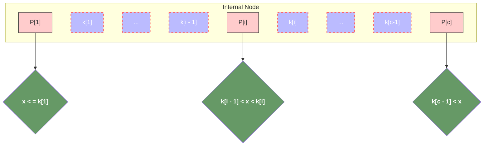
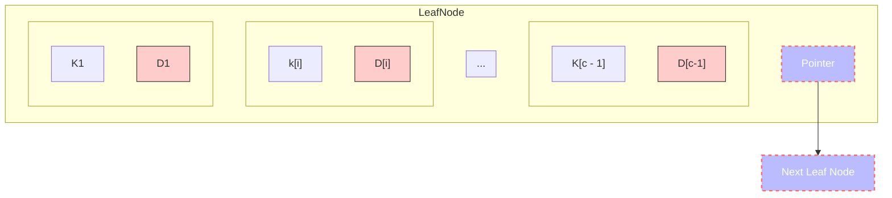
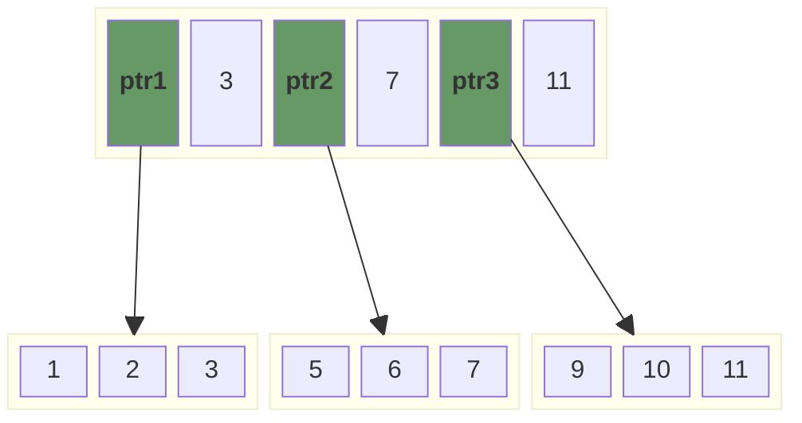
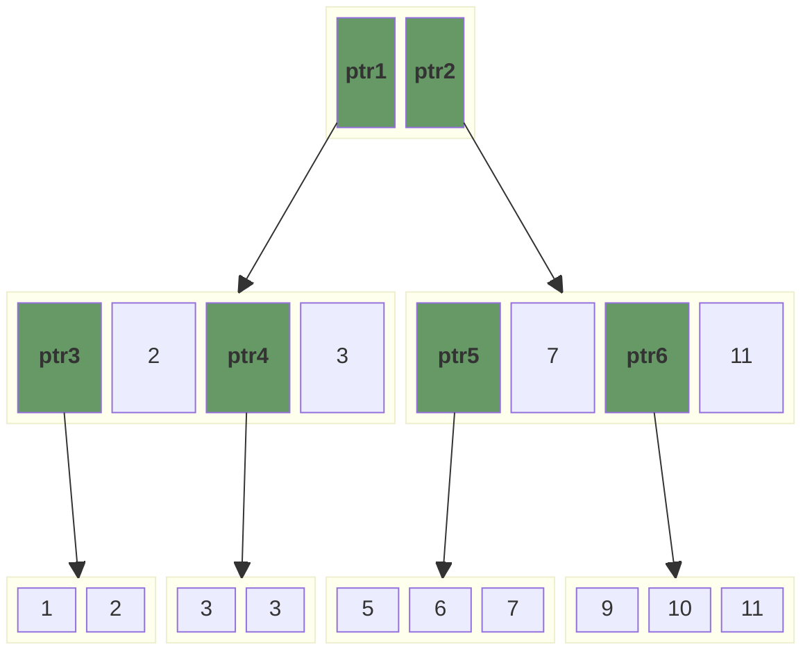

# tiny-tree

Record a simple snippet of code appearing in mind.

## b-plus-tree

B+ tree, unlike a B-tree, has two orders, ‘a’ and ‘b’, one for the internal nodes and the other for the external (or leaf) nodes. 

B+ Trees contain two types of nodes:

- ***\*Internal Nodes:\**** Internal Nodes are the nodes that are present in at least n/2 record pointers, but not in the root node,
- ***\*Leaf Nodes:\**** Leaf Nodes are the nodes that have n pointers.

### The Structure of the Internal Nodes of a B+ Tree of Order `a` is as Follows



- `P` stands for a pointer points to another non-leaf node or leaf node;
- `K` stands for the key-value parit of data, which is ordered;
- `a` stands for the order of a B+Tree;
- `c` stands for the maximum size of internal node, in other words, it compel `c <= a`;
- Each internal node has at most a tree pointer;
- The root node has, at least two tree pointers, while the other internal nodes have at least `ceil(a / 2)` tree pointers each;
- If an internal node has `c` pointer, **c <= a**, then it has `c - 1` key-value pairs.

### The structure of The Leaf Nodes of a B+Tree of Order 'b' is as Follows



- `c` <= `b` and each `D[i]` is a data pointer points to a acutal record in the disk whose key-value pair is K[i] or to a disk file block containing that record;
- k1 < k2 < ...
- Each leaf node has at least `ceil(b / 2)`
- All leaf nodes are the same level.

### insert



> insert 3


> size of first leaf node exceed maximum size of leaf, start divide.

 ```mermaid
 block-beta
 columns 10
 
 space:2
 block:rootNode:6
     ptr1
     node4["2"]
     ptr2
     node14["3"]
     ptr3
     node8["7"] 
     ptr4
     node12["12"]
 end
 space:2
 
 space:10
 
 block:leftNode:2
     node1["1"]
     node2["2"]
 end
 
 block:leftNode2:2
     node3["3"]
     node13["3"]
 end
 
 block:middleNode:3
     node5["5"]
     node6["6"]
     node7["7"]
 end
 
 block:rightNode:3
     node9["9"]
     node10["10"]
     node11["11"]
 end
 
 ptr1 --> leftNode
 ptr2 --> leftNode2
 ptr3 --> middleNode
 ptr4 --> rightNode
 
 class ptr1 header
 class ptr2 header
 class ptr3 header
 class ptr4 header
 
 classDef front 1,fill:#FFCCCC,stroke:#333;
 classDef back fill:#969,stroke:#333;
 classDef op fill:#bbf,stroke:#f66,stroke-width:2px,color:#fff,stroke-dasharray: 5 5
 classDef header fill: #696,color: #fff,font-weight: bold,padding: 10px;
 ```

> size of root node exceed maximum size of non-leaf node, start divide.



### reference

- [Introduction of B+ Tree](https://www.geeksforgeeks.org/introduction-of-b-tree/)
- [Insertion in a B+ tree](https://www.geeksforgeeks.org/insertion-in-a-b-tree/)
- [Deletion in B+Trees](https://www.geeksforgeeks.org/deletion-in-b-tree/)

