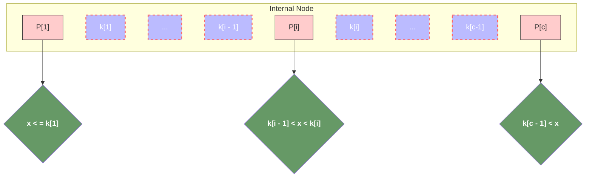
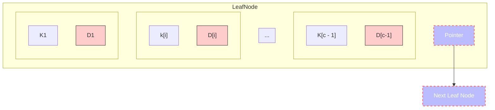
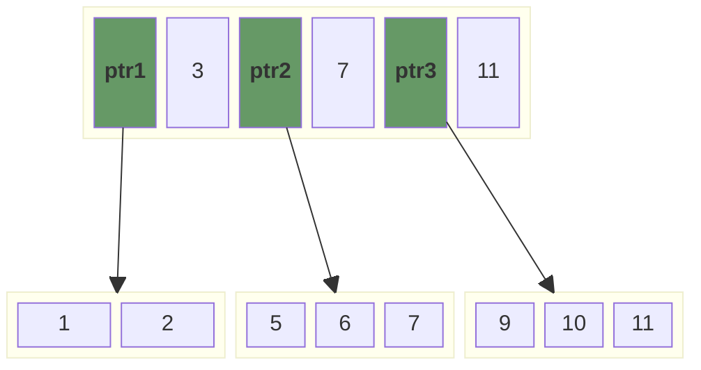
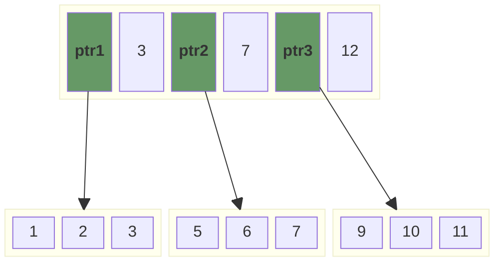
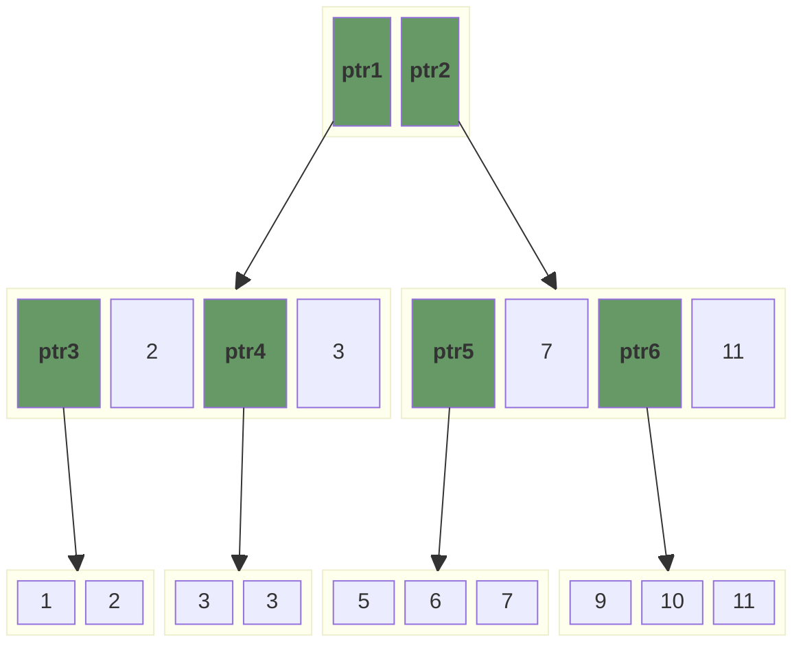
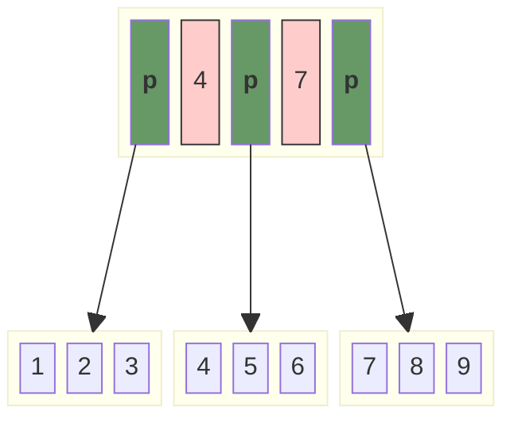
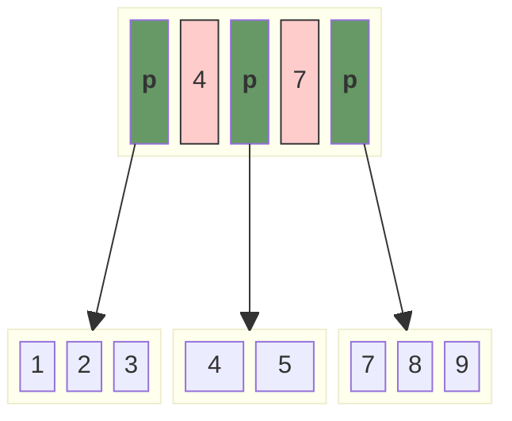
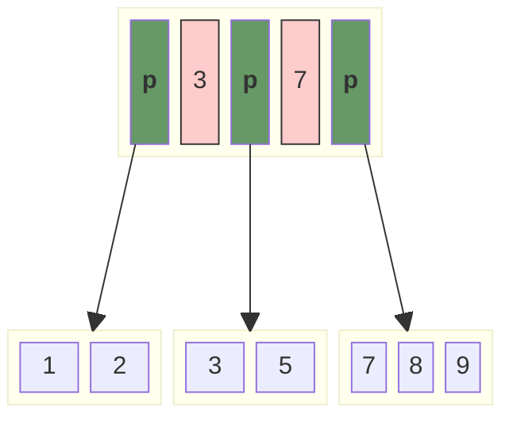
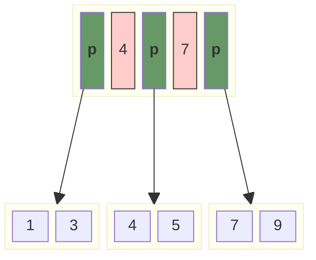
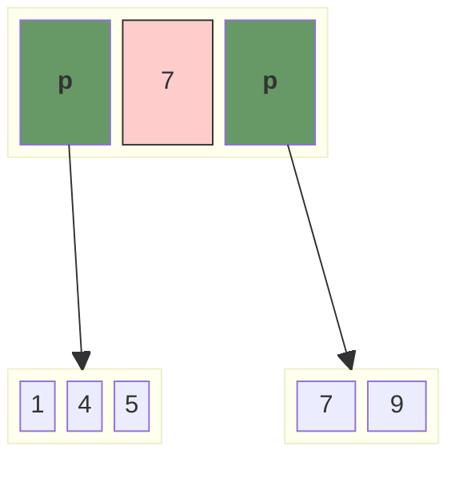

# B+ Tree

> 1. [Here is an explanation of B+Tree in java version](./version-01.md)
> 2. [Here is another explanation of B+Tree in java version](./version-02.md)

## Performance Optimization Plan

- ❌ Using a red-black tree to replace the array inside the B+Tree in order to decrease the performance of insert and delete operations.
- ❌ Using `[]byte` to replace the `slice` inside in order to save the memory usage.
- ✅ fix severe BUG : **leaf nodes could become invalid under certain special conditions.**

## reference

- [B+ Tree (programiz)](https://www.programiz.com/dsa/b-plus-tree)
- [insertion-into-a-b-tree](https://www.programiz.com/dsa/insertion-into-a-b-tree)
- [deletion-from-a-b-plus-tree](https://www.programiz.com/dsa/deletion-from-a-b-plus-tree)

- [Introduction of B+ Tree](https://www.geeksforgeeks.org/introduction-of-b-tree/)
- [Insertion in a B+ tree](https://www.geeksforgeeks.org/insertion-in-a-b-tree/)
- [Deletion in B+Trees](https://www.geeksforgeeks.org/deletion-in-b-tree/)

## What's B+ Tree

B+ tree, unlike a B-tree, has two orders, ‘a’ and ‘b’, one for the internal nodes and the other for the external (or leaf) nodes.

B+ Trees contain two types of nodes:

- **Internal Nodes:** Internal Nodes are the nodes that are present in at least n/2 record pointers, but not in the root node,
- **Leaf Nodes:** Leaf Nodes are the nodes that have n pointers.

### The Structure of the Internal Nodes of a B+ Tree of Order `a` is as Follows



- `P` stands for a pointer points to another non-leaf node or leaf node;
- `K` stands for the key-value pair of data, which is ordered;
- `a` stands for the order of a B+Tree;
- `c` stands for the maximum size of internal node, in other words, it compel `c <= a`;
- Each internal node has at most a tree pointer;
- The root node has, at least two tree pointers, while the other internal nodes have at least `ceil(a / 2)` tree pointers each;
- If an internal node has `c` pointer, **c <= a**, then it has `c - 1` key-value pairs.

### The structure of The Leaf Nodes of a B+Tree of Order 'b' is as Follows



- `c` <= `b` and each `D[i]` is a data pointer points to a actual record in the disk whose key-value pair is K[i] or to a disk file block containing that record;
- k1 < k2 < ...
- Each leaf node has at least `ceil(b / 2)`
- All leaf nodes are the same level.

## Insertion



> insert 3



> size of first leaf node exceed maximum size of leaf, start divide.

 ```mermaid
 block-beta
 columns 10

 space:2
 block:rootNode:6
     ptr1
     node4["2"]
     ptr2
     node14["3"]
     ptr3
     node8["7"]
     ptr4
     node12["12"]
 end
 space:2

 space:10

 block:leftNode:2
     node1["1"]
     node2["2"]
 end

 block:leftNode2:2
     node3["3"]
     node13["3"]
 end

 block:middleNode:3
     node5["5"]
     node6["6"]
     node7["7"]
 end

 block:rightNode:3
     node9["9"]
     node10["10"]
     node11["11"]
 end

 ptr1 --> leftNode
 ptr2 --> leftNode2
 ptr3 --> middleNode
 ptr4 --> rightNode

 class ptr1 header
 class ptr2 header
 class ptr3 header
 class ptr4 header

 classDef front 1,fill:#FFCCCC,stroke:#333;
 classDef back fill:#969,stroke:#333;
 classDef op fill:#bbf,stroke:#f66,stroke-width:2px,color:#fff,stroke-dasharray: 5 5
 classDef header fill: #696,color: #fff,font-weight: bold,padding: 10px;
 ```

> size of root node exceed maximum size of non-leaf node, start divide.



## Deletion

Before going through the steps below, one must know these facts about a B+ tree of degree **m**(m = order - 1).

1. A node can have a maximum of `m` children. (i.e. 3);
2. A node can contain a maximum of `m - 1` keys. (i.e. 2);
3. A node should have a minimum of `⌈m/2⌉` children. (i.e. 2);
4. A node (except root node) should contain a minimum of `⌈m/2⌉ - 1` keys. (i.e. 1)

### Pseudocode

```rust
let node_to_be_deleted = find_node();
let node_after_deletion = delete_node(node_to_be_deleted);

if check_minimum_number_of_node(node_after_deletion) {
    if immediate_sibling_contains_enough_numbers {
        borrow_from_immediate_sibling(parent);
    } else {
        shrink_childs_of_current_node();
    }
}

if parent.has_childs() {
    // reconstruct key and childs
    parent.reconstruct_internal_structure();
    // it's is important to update the keys when delete a key appears in the internal node.
    parent.update_keys_if_key_appears_in_internal_node();
} else {
    parent.shrink_parent();
}
```

### The key to be deleted was not found

> Return and do nothing.

### Leaf nodes are still suitable after deletion

> Delete the corresponding key and return.



> Delete `4`


### Leaf nodes are less than minimum size after deletion

> One of the following steps should be taken if the node underflow :
>
> - Get a key by borrowing it from a `sibling` node if it contains more keys than the required minimum.
> - If the minimal number of keys is met by all of the sibling nodes, merge the underflow node with one of its siblings and modify the parent node as necessary.
>
> The principle is to maintain the balance of the tree after deletion.

#### Borrowing from sibling



> Delete `4`：
>
> 1. Borrowing a node from siblings, and the procedure of borrowing might reconstruct the whole node;
> 2. Pop the change to their parent in order to reconstruct the indices, fortunately, the grandparent will remains the same as the reconstruction of indices doesn't decrease the minimum value or increase the maximum value, thus maintaining the balance of the tree.



#### underflow met by all of the sibling



> Delete `3`



