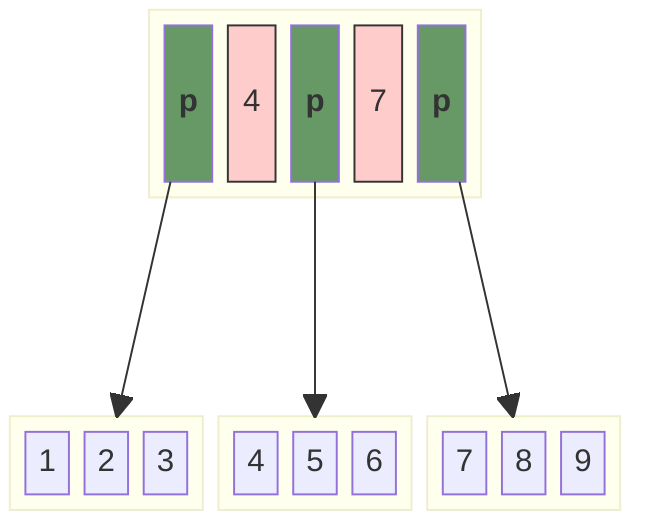
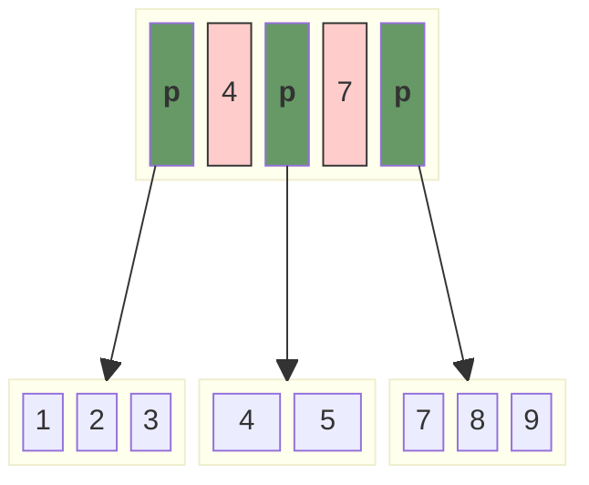
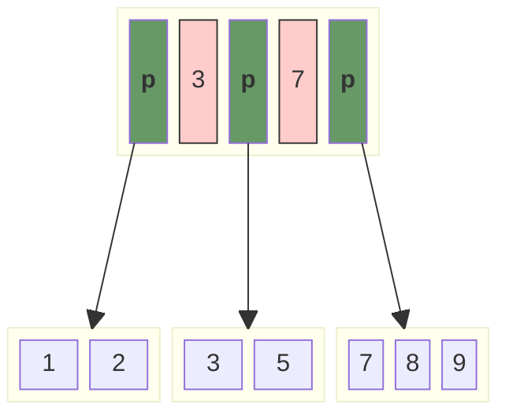
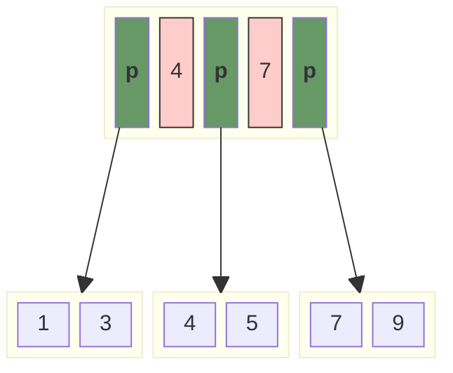
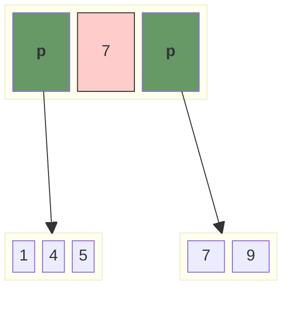

# readme

> [Here is another explanation of B+Tree in java version](./java-code-with-explanation.md)

## Performance Optimization Plan

- ❌ Using a red-black tree to replace the array inside the B+Tree in order to decrease the performance of insert and delete operations.
- ❌ Using `[]byte` to replace the `slice` inside in order to save the memory usage.
- ✅ fix severe BUG : **leaf nodes could become invalid under certain special conditions.**√

## Deletion on B+ Tree

### The key to be deleted was not found

> Return and do nothing.

### Leaf nodes are still suitable after deletion

> Delete the corresponding key and return.

> Delete `4`

### Leaf nodes are less than minimum size after deletion

> One of the following steps should be taken if the node underflow :
>
> - Get a key by borrowing it from a `sibling` node if it contains more keys than the required minimum.
> - If the minimal number of keys is met by all of the sibling nodes, merge the underflow node with one of its siblings and modify the parent node as necessary.
>
> The principle is to maintain the balance of the tree after deletion.

#### Borrowing from sibling

> Delete `4`：
>
> 1. Borrowing a node from siblings, and the procedure of borrowing might reconstruct the whole node;
> 2. Pop the change to their parent in order to reconstruct the indices, fortunately, the grandparent will remains the same as the reconstruction of indices doesn't decrease the minimum value or increase the maximum value, thus maintaining the balance of the tree.

#### underflow met by all of the sibling

> Delete `3`

