# Red Black Tree and AVL

## Red Black Tree

### insert data to a `2-` node

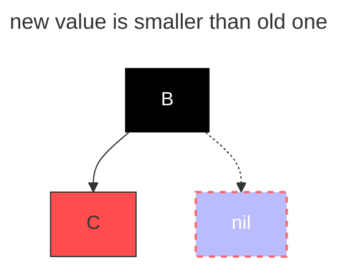

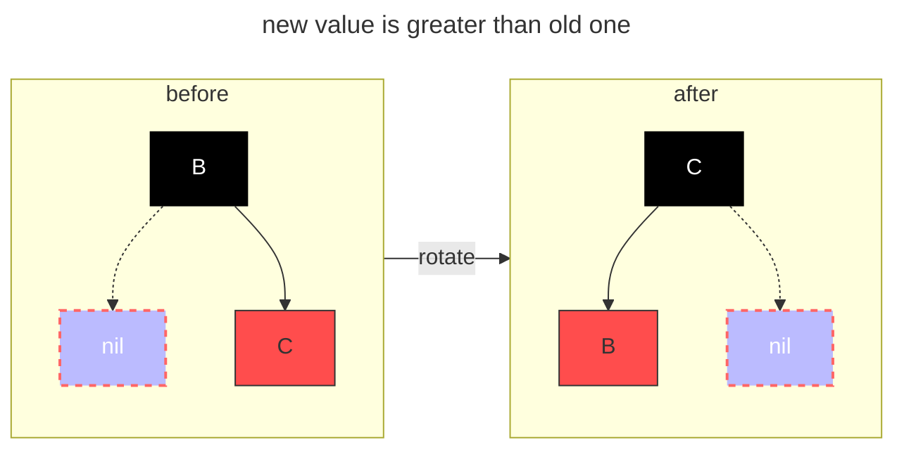

> 1. the new node is always a `red` node;
> 2. if there is a right-side red link, we rotate it to get a left-side red link.

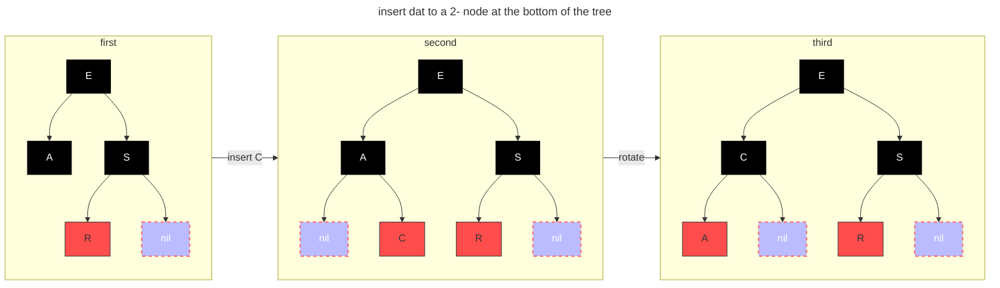

### insert data to a `3-` node

> new node is the greatest one

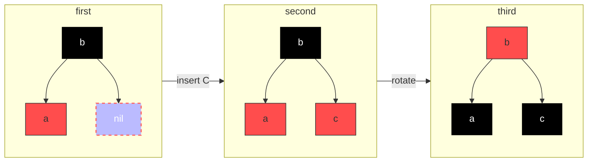

> new node is the smallest one

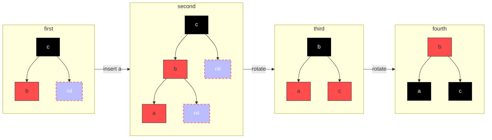

> new node is the medium one:

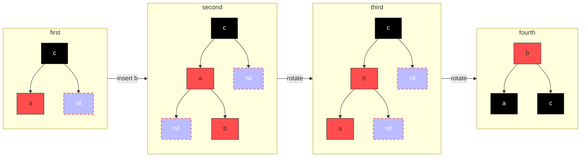

### rotate

#### left rotate

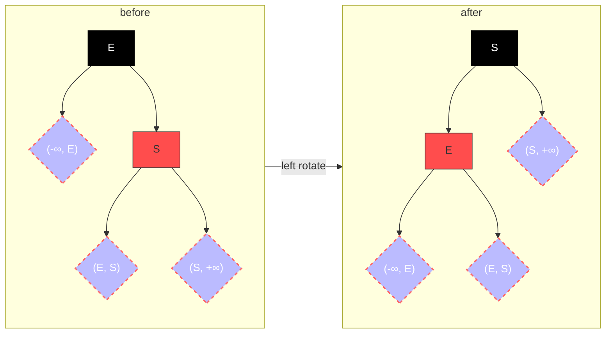

#### right rotate

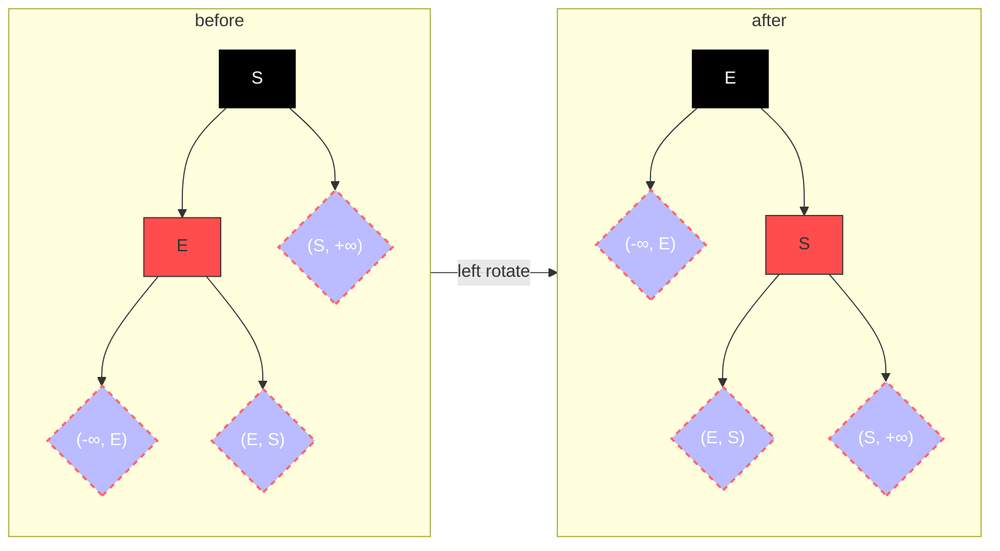

## AVL

### left rotation

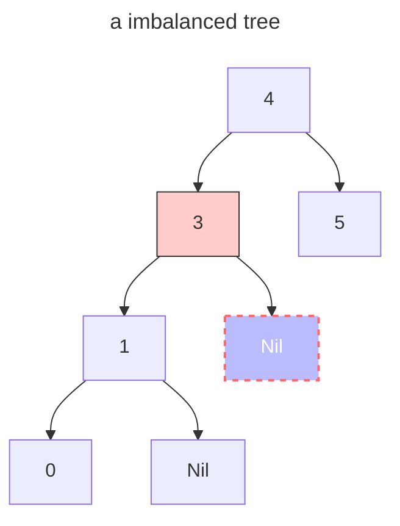

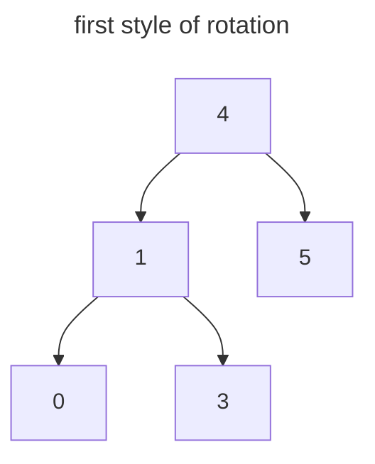

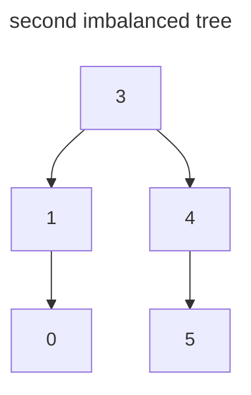

### the rotation of each different situations

> The other situation is just converse to below situation.

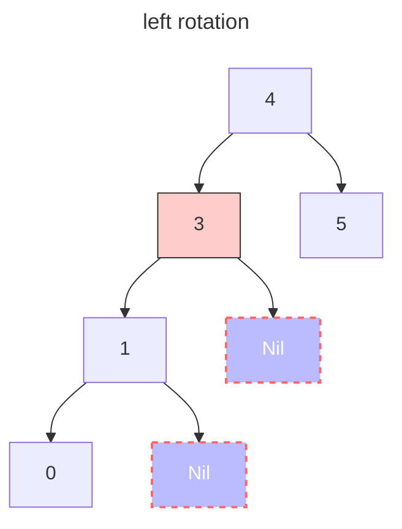

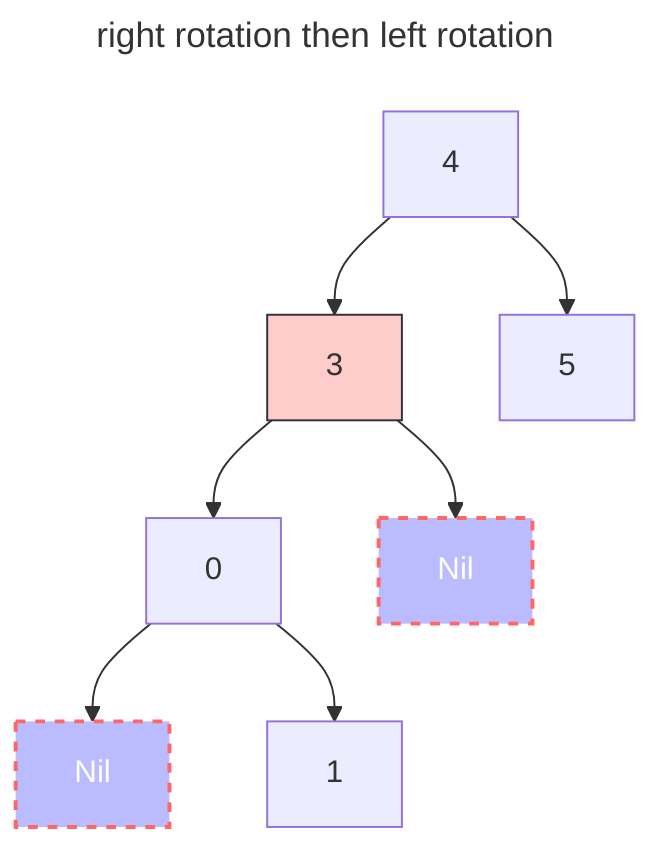

### how to choose strategy

| factor of imbalanced node | factor of imbalanced node's child node | strategy                          |
| ------------------------- | -------------------------------------- | --------------------------------- |
| > 1                       | > 0                                    | right rotation                    |
| > 1                       | < 0                                    | left rotation then right rotation |
| < 1                       | > 0                                    | right rotation then left rotation |
| < 1                       | < 0                                    | left rotation                     |

