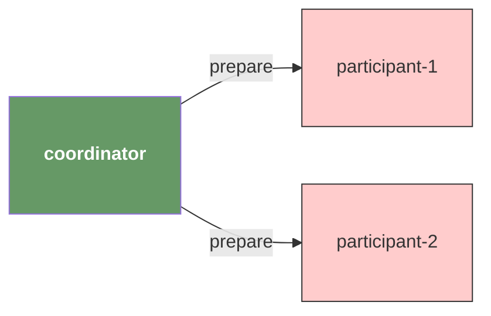
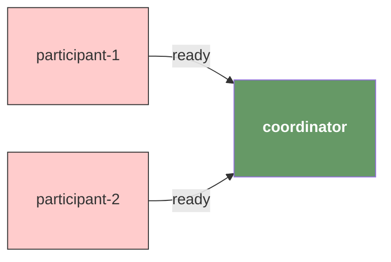
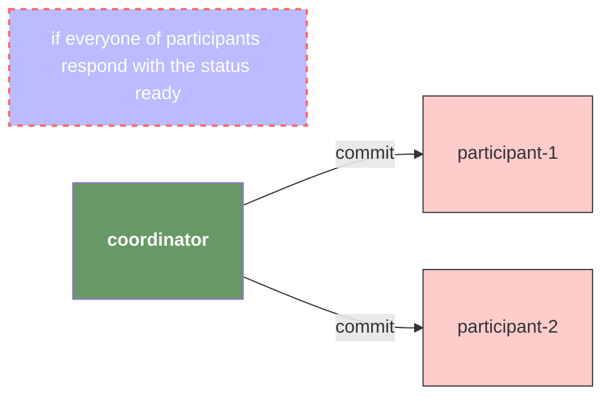
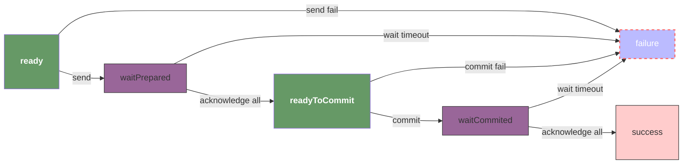
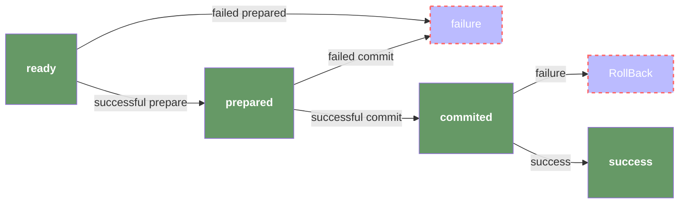

# 2PC

> Assuming we have two participants in the 2pc transaction.

## HOW?

### Prepare



### ready

All participants must respond with the status **ready** to the coordinator in order to indicate that it's time to proceed to the next step of the transaction.



### commit



### RollBack

If any of participants failed during the period of commit, then all of them must roll back.

````mermaid
flowchart LR

note["if any of participants failed, everyone must roll back"]:::dotted

coordinator:::green

p1["participant-1"]:::pink
p2["participant-2"]:::pink

coordinator -->|roll_back| p1
coordinator -->|roll_back| p2

classDef pink   1,fill:#FFCCCC,stroke:#333,ont-weight: bold,padding: 10px;
classDef green  fill: #696,color: #fff,font-weight: bold,padding: 10px;
classDef purple fill:#969,stroke:#333;
classDef dotted fill:#bbf,stroke:#f66,stroke-width:2px,color:#fff,stroke-dasharray: 5 5
````

## Error Handling

### Coordinator functions normally

1. Any participants return an error during **prepare phase**, the coordinator detects the failure and aborts the transaction;
2. Any participants return an error during **commit phase**, the coordinator detects the failure and initiates a rollback to maintain consistency;

### Coordinator experiences an internal exception

This case presents a challenging scenario where we assume the coordinator will be restored through a mechanism such as Leader Election. This implies that the participants are required to maintain their current state and await instructions from the coordinator. They should refrain from changing their state until they receive a signal from the coordinator.

## Details

The entire process can be broken down into the following steps:

1. The coordinator sends a _prepare_ instruction to all participants.
2. Participants receive the _prepare_ instruction and respond to the coordinator with either "ready" or "not ready".
3. After acknowledging that all participants are ready, the coordinator sends a _commit_ instruction to all participants.
4. Participants receive the _commit_ instruction and respond to the coordinator with either "committed" or "not committed".
5. The coordinator marks the state of the transaction as either "success" or "failure".

### State machine of coordinator



### State machine of participant

> The most major difference between state machine of either coordinator and participant is that participant always await for a instruction from coordinator, that also means the resources being _prepared_ or _committed_ by participant will be **locked** until the ending of the transaction. Also, what if the coordinator crushed, that's a big chance in productive environment! So that's why we need the other types of protocol such as 3PC/Segma.



